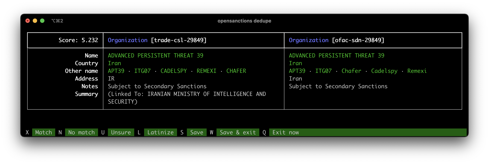

# nomenklatura

Nomenklatura de-duplicates and integrates different [Follow the Money](https://followthemoney.rtfd.org/) entities. It serves to clean up messy data and to find links between different datasets.



## Usage

You can install `nomenklatura` via PyPI:

```bash
$ pip install nomenklatura
```

### Command-line usage

Much of the functionality of `nomenklatura` can be used as a command-line tool. In the following example, we'll assume that you have a file containing [Follow the Money](https://followthemoney.rtfd.org/) entities in your local directory, named `entities.ijson`. If you just want try it out, you can use the file `tests/fixtures/donations.ijson` in this repository for testing (it contains German campaign finance data).

With the file in place, you will cross-reference the entities to generate de-duplication candidates, then run the interactive de-duplication UI in your console, and eventually apply the judgements to generate a new file with merged entities:

```bash
# generate merge candidates using an in-memory index:
$ nomenklatura xref -r resolver.json entities.ijson
# note there is now a new file, `resolver.json` that contains de-duplication info.
$ nomenklatura dedupe -r resolver.json entites.ijson
# will pop up a user interface.
$ nomenklatura apply entities.ijson -o merged.ijson -r resolver.json
# de-duplicated data goes into `merged.ijson`:
$ cat entities.ijson | wc -l 
474
$ cat merged.ijson | wc -l 
468 
```

### Programmatic usage

The command-line use of `nomenklatura` is targeted at small datasets which need to be de-duplicated. For more involved scenarios, the package also offers a Python API which can be used to control the semantics of de-duplication.

* `nomenklatura.Dataset` - implements a basic dataset for describing a set of entities.
* `nomenklatura.Store` - a general purpose access mechanism for entities. By default, a store is used to access entity data stored in files as an in-memory cache, but the store can be subclassed to work with entities from a database system.
* `nomenklatura.Index` - a full-text in-memory search index for FtM entities. In the application, this is used to block de-duplication candidates, but the index can also be used to drive an API etc.
* `nomenklatura.index.TantivyIndex` - a wrapper around Tantivy for indexing and matching FtM entities.
* `nomenklatura.Resolver` - the core of the de-duplication process, the resolver is essentially a graph with edges made out of entity judgements. The resolver can be used to store judgements or get the canonical ID for a given entity.

All of the API classes have extensive type annotations, which should make their integration in any modern Python API simpler.

## Design

This package offers an implementation of an in-memory data deduplication framework centered around the FtM data model. The idea is the following workflow:

* Accept FtM-shaped entities from a given loader (e.g. a JSON file, or a database)
* Build an in-memory inverted index of the entities for dedupe blocking
* Generate merge candidates using the blocking index and FtM compare
* Provide a file-based storage format for merge challenges and decisions
* Provide a text-based user interface to let users make merge decisions

Later on, the following might be added:

* A web application to let users make merge decisions on the web

### Resolver graph

The key implementation detail of nomenklatura is the `Resolver`, a graph structure that
manages user decisions regarding entity identity. Edges are `Judgements` of whether
two entity IDs are the same, not the same, or undecided. The resolver implements an
algorithm for computing connected components, which can the be used to find the best
available ID for a cluster of entities. It can also be used to evaluate transitive
judgements, e.g. if A <> B, and B = C, then we don't need to ask if A = C.

## Reading

* https://dedupe.readthedocs.org/en/latest/
* https://github.com/OpenRefine/OpenRefine/wiki/Reconcilable-Data-Sources
* https://github.com/OpenRefine/OpenRefine/wiki/Clustering-In-Depth
* https://github.com/OpenRefine/OpenRefine/wiki/Reconciliation-Service-API


## Contact, contributions etc.

This codebase is licensed under the terms of an MIT license (see LICENSE).

We're keen for any contributions, bug fixes and feature suggestions, please use the GitHub issue tracker for this repository. 

Nomenklatura is currently developed thanks to a Prototypefund grant for [OpenSanctions](https://opensanctions.org). Previous iterations of the package were developed with support from [Knight-Mozilla OpenNews](http://opennews.org) and the [Open Knowledge Foundation Labs](http://okfnlabs.org).
